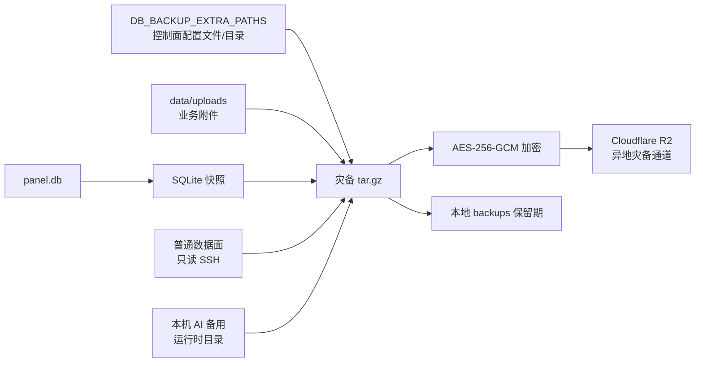

# 灾备归档与 Cloudflare R2 上传通道

本模块只说明如何生成加密灾备归档并上传到 Cloudflare R2。它不负责故障切换或在线热备；节点快速恢复的准备命令见[节点备份完整性与快速恢复](node-recovery.md)。

## 目标与边界

- 每日生成一个本地 SQLite 快照。
- 将数据库快照和配置文件、运行时配置等额外文件打成一个 `tar.gz`。
- 通过 Cloudflare R2 S3 兼容 API 保存加密灾备归档。
- R2 只作为低频、异地、离线恢复通道，不参与快速恢复或故障切换。

## 归档流程



任务入口是 `scripts/run_db_backup_cycle.py`：

1. 调用 `scripts/backup_db.py`，通过 SQLite 在线备份 API 生成 `backups/<prefix>-<UTC 时间戳>.db`。
2. `DB_BACKUP_SSH_COLLECTION_ENABLED=1` 时，调用 `scripts/collect_remote_backup.py`，以严格只读 SSH 采集普通数据面的主配置与可选环境文件；本机 AI 备用由 `DB_BACKUP_EXTRA_PATHS` 归档，不发起 AI SSH。
3. 调用 `scripts/build_backup_bundle.py`，把数据库快照放在 `database/`、控制面额外路径放在 `config/`、远端 staging 放在 `nodes/`，并写入 `backup-manifest.json` 和 `node-recovery-manifest.json`。
4. 重新校验归档内所有文件的大小和 SHA-256，并把节点恢复状态写入 `node-recovery-status.json`。
5. `DB_BACKUP_R2_ENABLED=1` 时，使用 R2 S3 兼容 API 上传加密归档。
6. 上传记录写入 `DB_BACKUP_R2_RECORD_PATH`，本地文件保留用于核验和节点恢复准备。

单次任务的组件边界如下：

```text
backup_db.py              只负责 SQLite 快照
collect_remote_backup.py  只负责 SSH 只读采集和 staging manifest
build_backup_bundle.py    只负责文件收集、归档和校验元数据
upload_backup_r2.py        只负责 R2 S3 兼容 API 上传和记录
```

## 默认收集内容

Docker Compose 的备份容器默认收集：

- 当次生成的 `panel.db` 一致性快照
- `/srv/xray-ops/ops.db` 的独立 SQLite 在线快照（存在时）
- Compose、ops-reporting Compose、`.env`/`.env.ops-reporting`
- Xray `.env`、渲染运行配置、报告、备份脚本和 `data/uploads`

项目目录和 `/srv/xray-ops` 均只读挂载到备份容器；缺失的可选文件会记录在 manifest 中，不阻断 `panel.db` 备份。启用 SSH 采集后，归档还会加入：

```text
database/
config/                       # 控制面 DB_BACKUP_EXTRA_PATHS
nodes/
  normal-data-plane/...       # 普通数据面主机实际路径
  app/xray/runtime/config-ai-node.json
  remote-node-collection.json
backup-manifest.json
node-recovery-manifest.json
```

普通数据面通过控制面内网 SSH `root@100.116.187.106:22` 管理，主配置是 `/root/xray-routing-panel/app/xray/runtime/config.json`；AI 备用运行在控制面本机 `redacted-ip-004`，配置 `config-ai-node.json` 随控制面运行时目录归档。远端采集结果记录在 `nodes/remote-node-collection.json`。完整 SSH 边界见[远端节点配置采集](remote-node-backup.md)。

## 配置

| 变量 | 默认值 | 说明 |
| --- | --- | --- |
| `DB_BACKUP_BUNDLE_ENABLED` | `1` | 是否生成灾备归档；关闭后仍保留单独 `.db` 快照 |
| `DB_BACKUP_EXTRA_PATHS` | Compose 中的显式项目配置 allowlist | 逗号或换行分隔的文件、目录或 glob；不存在的可选路径会记录并跳过 |
| `DB_BACKUP_OPS_DB_PATH` | `/ops-data/ops.db` | 可选运维 SQLite 数据库；使用 SQLite backup API 生成一致性副本后纳入归档 |
| `DB_BACKUP_BUNDLE_DIR` | `DB_BACKUP_DIR` | 灾备归档本地目录 |
| `DB_BACKUP_BUNDLE_KEEP_DAYS` | `DB_BACKUP_KEEP_DAYS` | 本地灾备归档保留天数，`0` 表示不清理 |
| `DB_BACKUP_BUNDLE_PREFIX` | `DB_BACKUP_PREFIX` | 归档名前缀 |
| `DB_BACKUP_SSH_COLLECTION_ENABLED` | Compose 为 `1`，脚本默认 `0` | 是否在打包前通过 SSH 读取普通数据面 |
| `DB_BACKUP_SSH_COLLECTION_REQUIRED` | `0` | `1` 时所有已配置远端节点的必需恢复文件必须成功；`0` 时记录失败但继续保留控制面归档 |
| `DB_BACKUP_DATAPLANE_SSH_TARGET` | `root@100.116.187.106` | 普通数据面内网 SSH 目标；采集器不使用私钥 |
| `DB_BACKUP_SSH_OPTIONS` | 空 | 仅允许 `-4`/`-6`、日志级别和连接超时/keepalive 等安全选项 |
| `DB_BACKUP_DATAPLANE_REMOTE_PATHS` | 普通数据面配置、`.env`、运行时产物和最新报告 | 逗号/换行分隔；配置和 `.env` 是恢复必需文件，其余为可选 |
| `DB_BACKUP_DATAPLANE_DEPLOY_ROOT` | `/root/xray-routing-panel` | 将远端路径映射到便携恢复目录的部署根 |
| `DB_BACKUP_AI_NODE_SSH_PORT` | `22` | 仅在显式启用远端 AI 节点 SSH 采集时使用 |
| `DB_BACKUP_AI_NODE_REMOTE_PATHS` | 空 | 当前本机 AI 备用不使用远端采集 |
| `DB_BACKUP_AI_NODE_DEPLOY_ROOT` | `/root/xray-routing-panel` | 远端 AI 节点的部署根 |
| `DB_BACKUP_RECOVERY_REQUIRED` | `0` | `1` 时不完整节点恢复包阻止后续上传；默认保留数据库备份并记录状态 |
| `DB_BACKUP_RECOVERY_STATUS_PATH` | 归档目录下的 `node-recovery-status.json` | 最近一次节点恢复完整性报告 |
| `DB_BACKUP_R2_ENABLED` | `1`（Compose） | 是否将加密灾备归档上传到 R2；直接执行脚本时需显式设置并注入凭据 |
| `DB_BACKUP_R2_ENDPOINT` | 空 | Cloudflare R2 S3 endpoint |
| `DB_BACKUP_R2_BUCKET` | 空 | R2 bucket 名称 |
| `DB_BACKUP_R2_ACCESS_KEY_ID` | 空 | R2 S3 access key ID |
| `DB_BACKUP_R2_SECRET_ACCESS_KEY` | 空 | R2 S3 secret；仅通过部署环境注入 |
| `DB_BACKUP_R2_PREFIX` | `xray-routing-panel` | 对象 key 前缀 |
| `DB_BACKUP_R2_RECORD_PATH` | `/backups/r2-upload-record.json` | 本地上传记录 |

示例：加入控制面项目文件和自定义密钥目录（目录必须以只读方式挂载到备份容器）：

```dotenv
DB_BACKUP_EXTRA_PATHS=/app/xray/.env,/app/xray/runtime,/app/xray/reports,/data/uploads,/backup-input/docker-compose.yml
```

`DB_BACKUP_EXTRA_PATHS` 路径会被写入归档的 `config/` 前缀下，远端 SSH staging 则写入 `nodes/`，避免恢复时覆盖宿主机绝对路径。归档内的 `backup-manifest.json` 记录每个文件的来源、大小和 SHA-256；`remote-node-collection.json` 记录 SSH 目标和逐路径状态；`node-recovery-manifest.json` 再声明哪些文件足以快速恢复每类节点。

`DB_BACKUP_EXTRA_PATHS` 可以包含业务敏感配置，但不要把 R2 密钥、SSH 私钥或其他不需要迁移的凭据目录加入列表；数据库快照和灾备归档在本地生成时仍是明文，文件权限统一为 `0600`，备份目录也必须限制为备份服务可读。R2 凭据只通过部署环境、Docker Secret 或外部 Secret 管理注入，灾备加密密码必须与 R2 Secret Access Key 分离保存。任何出现在聊天、日志或 shell 历史中的 token 都应立即撤销。

## R2 灾备保留策略

R2 上传成功后，本地会保留归档和 `r2-upload-record.json`。对象 key 包含 UTC 时间和归档 SHA-256 前缀，避免同名覆盖。R2 生命周期策略应在 Cloudflare 侧配置，不在面板任务中删除远端对象。

## 灾难阶段恢复

恢复仍是人工操作，不纳入健康检查或 DNS 故障切换。下载对象并用独立保存的 `DB_BACKUP_ENCRYPTION_PASSWORD` 解密后，按[节点备份完整性与快速恢复](node-recovery.md)执行 `validate` 和 `prepare`。准备目录自带单节点 `docker-compose.node.yml`，可直接启动 Xray；恢复后仍须人工完成新主机的 Tailscale、密钥、known_hosts、防火墙、控制面目标和业务验证。

解密结果只是归档文件，不会自动覆盖运行中的配置。R2 凭据仅用于下载对象，不等同于归档解密密码。

## 排查

- 本地 `.db` 有、归档没有：检查 `DB_BACKUP_BUNDLE_ENABLED`、`DB_BACKUP_BUNDLE_DIR` 的权限和备份容器日志。
- 归档有、R2 没有：检查 `DB_BACKUP_R2_ENABLED`、R2 凭据、endpoint、bucket 和备份容器网络访问。
- 配置文件缺失：查看 `backup-manifest.json` 的 `skippedExtraPaths` 和 `node-recovery-manifest.json` 的 `missingRequiredArtifacts`。
- `validate --require-ready` 失败：使用最近一个 `node-recovery-status.json` 为 `recoveryReady=true` 的归档，不要使用当前节点失联后生成的不完整版本。
